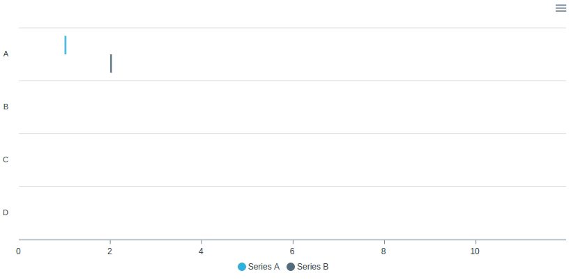
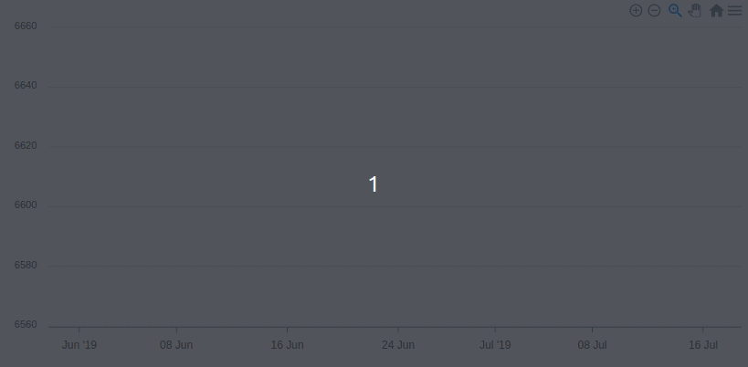
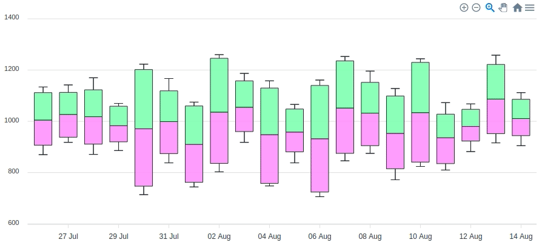
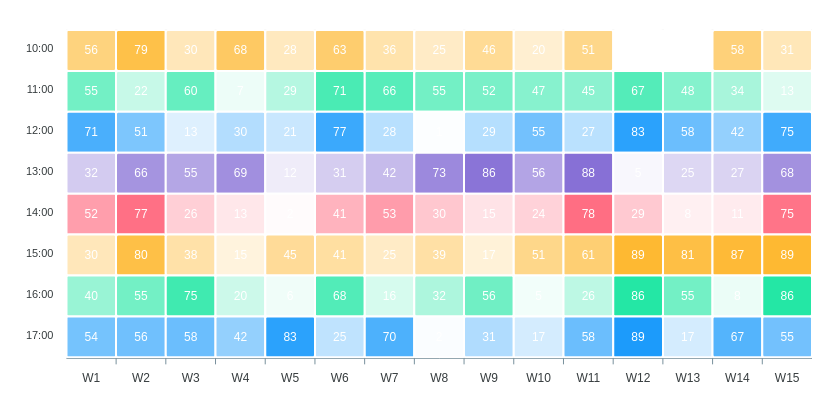
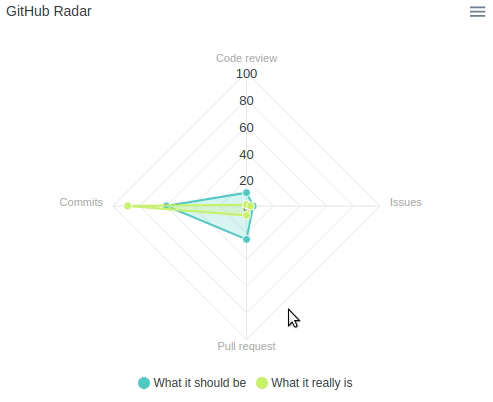
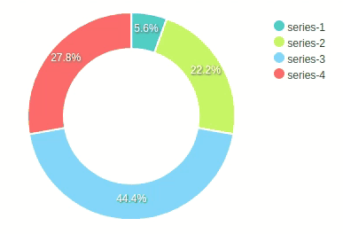
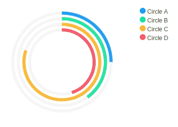
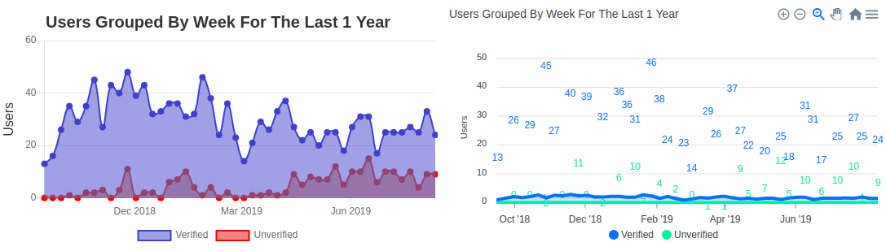

<p align="center">
  
</p>

<p align="center">
  <a href="https://rubygems.org/gems/apexcharts">
    
  </a>
  <a href="https://github.com/styd/apexcharts.rb/actions">
    
  </a>
  <a href="https://rubygems.org/gems/apexcharts">
    
  </a>
  
  <a href="https://github.com/styd/apexcharts.rb/blob/master/LICENSE">
    
  </a>
  <a href="https://codeclimate.com/github/styd/apexcharts.rb/maintainability">
    
  </a>
  <a href="https://codebeat.co/projects/github-com-styd-apexcharts-rb-master">
    
  </a>
  <a href='http://clayallsopp.github.io/readme-score/?url=styd/apexcharts.rb'>
    
  </a>
</p>


## About 

> ApexCharts.RB is a ruby charting library that's going to give your ruby app beautiful,
> interactive, and responsive charts powered by [ApexCharts.JS]. On top of those sweet
> advantages, you'll also get extra features that you can't get by just including ApexCharts.JS
> to your ruby app, namely **view/template helpers for creating charts**, **options shortcuts**,
> **application wide default options**, **reusable custom theme palette**, and so on.


## Trusted By

Organization/Company                                                   | Use Case
-----------------------------------------------------------------------|------------------------------------------------------------------
 | Reports/charts related to Operating Room utilization statistics
        | Enterprise dashboards to visualize account receivables data
       | Ticket sales for clients (visitor attractions and tour operators)

> If your organization/company uses ApexCharts.RB in production, please comment on
> [this issue](https://github.com/styd/apexcharts.rb/issues/34).


## README Versions

This README might not be for the version you use.  
Choose the right README:

> [v0.1.11] | [v0.1.10] | [v0.1.9] | [v0.1.8] | [v0.1.7] | [v0.1.6] |
> [v0.1.5] | [v0.1.4] | [v0.1.3] | [v0.1.2] | [v0.1.1]

## Table of Contents

- [About](#about)
- [Trusted By](#trusted-by)
- [README Versions](#readme-versions)
- [Table of Contents](#table-of-contents)
- [Usage](#usage)
  - [Cartesian Charts](#cartesian-charts)
    - [Line Chart](#line-chart)
    - [Stepline Chart](#stepline-chart)
    - [Area Chart](#area-chart)
    - [Column Chart](#column-chart)
    - [Bar Chart](#bar-chart)
    - [Range Bar Chart](#range-bar-chart)
    - [Scatter Chart](#scatter-chart)
    - [Candlestick Chart](#candlestick-chart)
    - [Box Plot Chart](#box-plot-chart)
    - [Mixed Charts](#mixed-charts)
    - [Syncing Charts](#syncing-charts)
    - [Brush Chart](#brush-chart)
    - [Annotations](#annotations)
  - [Heatmap Chart](#heatmap-chart)
  - [Radar Chart](#radar-chart)
  - [Bubble Chart](#bubble-chart)
  - [Polar Charts](#polar-charts)
    - [Pie Chart](#pie-chart)
    - [Donut Chart](#donut-chart)
    - [Radial Bar Chart](#radial-bar-chart)
- [Data Formats](#data-formats)
  - [Cartesian Charts](#cartesian-charts-1)
    - [Candlestick Chart](#candlestick-chart-1)
    - [Box Plot Chart](#box-plot-chart-1)
  - [Heatmap Chart](#heatmap-chart-1)
  - [Radar Chart](#radar-chart-1)
  - [Bubble Chart](#bubble-chart-1)
  - [Polar Charts](#polar-charts-1)
- [Options](#options)
  - [Global Options](#global-options)
  - [Formatter Function](#formatter-function)
  - [Defer Chart Rendering](#defer-chart-rendering)
- [Schema](#schema)
- [Reusable Custom Palette](#reusable-custom-palette)
- [Use Alongside Other Charting Libraries](#use-alongside-other-charting-libraries)
  - [Alongside Chartkick](#alongside-chartkick)
    - [Chartkick (Chart.js) and ApexCharts](#chartkick-chartjs-and-apexcharts)
    - [Chartkick (Google Charts) and ApexCharts](#chartkick-google-charts-and-apexcharts)
    - [Chartkick (Highcharts) and ApexCharts](#chartkick-highcharts-and-apexcharts)
- [Installation](#installation)
- [Web Support](#web-support)
  - [Rails](#rails)
  - [Sinatra](#sinatra)
  - [Plain HTML+ERB (Without Framework)](#plain-htmlerb-without-framework)
- [Contributing](#contributing)
- [License](#license)
- [Like the charts?](#like-the-charts)


## Usage

### Cartesian Charts

Example series used for cartesian charts:

```erb
<% series = [
  {name: "Inactive", data: @inactive_properties},
  {name: "Active", data: @active_properties}
] %>
```
To build the data, you can use gem [groupdate](https://github.com/ankane/groupdate).  
In my case, it was:

```ruby
@inactive_properties = Property.inactive.group_by_week(:created_at).count
@active_properties = Property.active.group_by_week(:created_at).count
```

and I'll get the data in this format:
```ruby
{
  Sun, 29 Jul 2018=>1,
  Sun, 05 Aug 2018=>6,
  ..
}
```
PS: `Property` can be any model you have and `inactive` and `active`
are just some normal ActiveRecord scopes. Keep scrolling down to see
accepted data formats.  

Example options used for cartesian charts:

```erb
<% options = {
  title: 'Properties Growth',
  subtitle: 'Grouped Per Week',
  xtitle: 'Week',
  ytitle: 'Properties',
  stacked: true
} %>
```


#### Line Chart

```erb
<%= line_chart(series, options) %>
```


#### Stepline Chart

```erb
<%= line_chart(series, {**options, theme: 'palette7', curve: 'stepline'}) %>
```


#### Area Chart

```erb
<%= area_chart(series, {**options, theme: 'palette5'}) %>
```


#### Column Chart

```erb
<%= column_chart(series, {**options, theme: 'palette4'}) %>
```


#### Bar Chart

```erb
<%= bar_chart(series, {**options, xtitle: 'Properties', ytitle: 'Week', height: 800, theme: 'palette7'}) %>
```


#### Range Bar Chart

```erb
<% range_bar_series = [{
      name: "Series A",
      data: {
        'A' => [1, 5],
        'B' => [4, 6],
        'C' => [5, 8],
        'D' => [3, 11]
      }
    }, {
      name: "Series B",
      data: {
        'A' => [2, 6],
        'B' => [1, 3],
        'C' => [7, 8],
        'D' => [5, 9]
      }
  }]
%>

<%= range_bar_chart(range_bar_series, theme: 'palette3') %>
```



#### Scatter Chart

```erb
<%= scatter_chart(series, {**options, theme: 'palette3'}) %>
```


#### Candlestick Chart

Candlestick chart is typically used to illustrate movements in the price of a
financial instrument over time. This chart is also popular by the name "ohlc chart".
That's why you can call it with `ohlc_chart` too.  
So, here's how you make it.

Given:
```erb
<%
  require 'date'

  def candlestick_data
    @acc = rand(6570..6650)
    60.times.map {|i| [Date.today - 60 + i, ohlc] }.to_h
  end

  def ohlc
    open = @acc + rand(-20..20)
    high = open + rand(0..100)
    low = open - rand(0..100)
    @acc = close = open + rand(-((high-low)/3)..((high-low)/2))
    [open, high, low, close]
  end

  candlestick_options = {
    plot_options: {
      candlestick: {
        colors: {
          upward: '#3C90EB',
          downward: '#DF7D46'
        }
      }
    }
  }
%>
```
You can make candlestick chart with this:
```erb
<%= candlestick_chart(candlestick_data, candlestick_options) %>
```



#### Box Plot Chart

Given:
```erb
<%
  require 'date'

  def box_plot_data
    20.times.map {|i| [Date.today - 20 + i, box_plot_datum] }.to_h
  end

  def box_plot_datum
    level = 1000
    max = level + rand(50..300)
    min = level - rand(50..300)
    q1 = min + rand(10..50)
    q3 = max - rand(10..50)
    median = (min + q1 + q3 + max)/4
    [min, q1, median, q3, max]
  end

  box_plot_options = {
    plot_options: {
      boxPlot: {
        colors: {
          upper: '#aaffaa',
          lower: '#ffaaFF'
        }
      }
    }
  }
%>
```
You can make box plot chart with this:
```erb
<%= box_plot_chart(box_plot_data, box_plot_options) %>
```



#### Mixed Charts

You can mix charts by using `mixed_charts` or `combo_charts` methods.
For example, given that:
```ruby
@total_properties = Property.group_by_week(:created_at).count
```
and
```erb
<% total_series = {
  name: "Total", data: @total_properties
} %>
```
you can do this:
```erb
<%= combo_charts({**options, theme: 'palette4', stacked: false, data_labels: false}) do %>
  <% line_chart(total_series) %>
  <% area_chart(series.last) %>
  <% column_chart(series.first) %>
<% end %>
```


#### Syncing Charts

You can synchronize charts by using `syncing_charts` or `synchronized_charts` methods. For
example:
```erb
<%= syncing_charts(chart: {toolbar: false}, height: 250, style: 'display: inline-block; width: 32%;') do %>
  <% mixed_charts(theme: 'palette4', data_labels: false) do %>
    <% line_chart({name: "Total", data: @total_properties}) %>
    <% area_chart({name: "Active", data: @active_properties}) %>
  <% end %>
  <% area_chart({name: "Active", data: @active_properties}, theme: 'palette6') %>
  <% line_chart({name: "Inactive", data: @active_properties}, theme: 'palette8') %>
<% end %>
```


#### Brush Chart

```erb
<%= area_chart(total_series, {
  **options, chart_id: 'the-chart', xtitle: nil, theme: 'palette2'
}) %>
<%= mixed_charts(brush_target: 'the-chart', theme: 'palette7') do %>
  <% column_chart(series.first) %>
  <% line_chart(series.last) %>
<% end %>
```


#### Annotations

All cartesian charts can have annotations, for example:

```erb
<%= area_chart(series, {**options, theme: 'palette9'}) do %>
  <% x_annotation(value: ('2019-01-06'..'2019-02-24'), text: "Busy Time", color: 'green') %>
  <% y_annotation(value: 29, text: "Max Properties", color: 'blue') %>
  <% point_annotation(value: ['2018-10-07', 24], text: "First Peak", color: 'magenta') %>
<% end %>
```


### Heatmap Chart

```erb
<% heatmap_series = 17.downto(10).map do |n|
  {
    name: "#{n}:00",
    data: 15.times.map do |i|
      ["W#{i+1}", rand(90)]
    end.to_h
  }
end %>
<%= heatmap_chart(heatmap_series) %>
```



### Radar Chart

```erb
<% radar_series = [
  {
    name: "What it should be",
    data: { "Code review"=>10, "Issues"=>5, "Pull request"=>25, "Commits"=>60 }
  },
  {
    name: "What it really is",
    data: { "Code review"=>1, "Issues"=>3, "Pull request"=>7, "Commits"=>89 }
  }
] %>
<%= radar_chart(
  radar_series,
  {title: "GitHub Radar", markers: {size: 4}, theme: 'palette4'}
) %>
```



### Bubble Chart

```erb
<% bubble_series = (1..4).map do |n|
  {
    name: "Bubble#{n}",
    data: 20.times.map{[rand(750),rand(10..60),rand(70)]}
  }
end %>
<%= bubble_chart(bubble_series, data_labels: false, theme: 'palette6') %>
```


### Polar Charts

#### Pie Chart

```erb
<%= pie_chart([
  {name: "Series A", data: 25},
  {name: "Series B", data: 100},
  {name: "Series C", data: 200},
  {name: "Series D", data: 125}
], legend: "left") %>
```


#### Donut Chart

```erb
<%= donut_chart([25, 100, 200, 125], theme: 'palette4') %>
```



#### Radial Bar Chart

Also called `circle_chart`.
```erb
<%= radial_bar_chart([
  {name: "Circle A", data: 25},
  {name: "Circle B", data: 40},
  {name: "Circle C", data: 80},
  {name: "Circle D", data: 45}
], legend: true) %>
```



## Data Formats

### Cartesian Charts

The data format for line, stepline, area, column, bar, and scatter
charts should be in following format **per-series**:

```ruby
{
  <x value> => <y value>,
  <x value> => <y value>,
  ...
}
```

or this:

```ruby
[
  [<x value>, <y value>],
  [<x value>, <y value>],
  ...
]
```

#### Candlestick Chart

Candlestick chart is just like other cartesian charts, only the y value is
an array of 4 members which called the OHLC (Open-High-Low-Close):

```ruby
{
  <x value> => [<Open>, <High>, <Low>, <Close>],
  <x value> => [<Open>, <High>, <Low>, <Close>],
  ...
}
```

or this:

```ruby
[
  [<x value>, [<Open>, <High>, <Low>, <Close>]],
  [<x value>, [<Open>, <High>, <Low>, <Close>]],
  ...
]
```

#### Box Plot Chart

Box plot chart is similar to candlestick chart, only the y value is
an array of 5 members (Minimum-First Quartile-Median-Third Quartile-Maximum):

```ruby
{
  <x value> => [<Min>, <Q1>, <Median>, <Q3>, <Max>],
  <x value> => [<Min>, <Q1>, <Median>, <Q3>, <Max>],
  ...
}
```

or this:

```ruby
[
  [<x value>, [<Min>, <Q1>, <Median>, <Q3>, <Max>]],
  [<x value>, [<Min>, <Q1>, <Median>, <Q3>, <Max>]],
  ...
]
```

### Heatmap Chart

The data format for heatmap chart **per-series** is similar to cartesian
charts. But instead of y values they are heat values. The series names will
be the y values.

```ruby
{
  <x value> => <heat value>,
  <x value> => <heat value>,
  ...
}
```

or this:

```ruby
[
  [<x value>, <heat value>],
  [<x value>, <heat value>],
  ...
]
```

### Radar Chart

The data format for radar chart **per-series** is also similar but instead
of x values they are variables and instead of y values they are the only
values for the variables with type of Numeric.

```ruby
{
  <variable> => <value>,
  <variable> => <value>,
  ...
}
```

or this:

```ruby
[
  [<variable>, <value>],
  [<variable>, <value>],
  ...
]
```


### Bubble Chart

Bubble chart is similar to scatter chart, only they have one more value
for bubble size:

```ruby
[
  [<x value>, <bubble size>, <y value>],
  [<x value>, <bubble size>, <y value>],
  ...
]
```

### Polar Charts

The data format for donut, pie, and radial bar are the simplest. They are
just any single value of type Numeric.


## Options

ApexCharts.RB supports [all options from ApexCharts.JS](https://apexcharts.com/docs/options/),
but instead of *camelCase*, you can write them in *snake_case*.

ApexCharts.RB also provides shortcuts to some ApexCharts.JS options, such as `title`. In
ApexCharts.JS you would have to write

```ruby
title: { text: "Some title" }
```
In ApexCharts.RB you can write
```ruby
title: "Some title"
```
if you just want to add the text.

`xtitle` and `ytitle` are even greater shortcuts. Instead of
```ruby
xaxis: { title: { text: "x title" } }
```
you can write
```ruby
xtitle: "x title"
```

```ruby
options = {
  animations: false, # Shortcut for chart: { animations: { enabled: false } }
  chart: {
    fontFamily: "Helvetica, Arial, sans-serif",
    toolbar: {
      show: false
    }
  },
  curve: "straight", # Shortcut for stroke: { curve: "straight" }
  markers: {
    size: 5,
  },
  tooltip: false, # Shortcut for tooltip: { enabled: false }
  xtitle: "Boars per capita"
}
```

These options can be passed to any chart helper like `<%= line_chart(series, options) %>`.

### Global Options

To use default options globally, you can specify config for default options before calling
your charts. In Rails, put it in `initializers` directory. For example:

```ruby
# config/initializers/apexcharts.rb

ApexCharts.config.default_options = {
  data_labels: false,
  tootip: true,
  theme: 'my-theme'
}
```

All charts will then automatically pick up these global options, which can be overwritten
individually by any options passed to the relevant chart helper.

### Formatter Function

To use a _simple_ formatter function (e.g. formatter in `tooltip`, `data_labels`, and `labels`),
you can add [functionable-json](https://github.com/styd/functionable-json) to your Gemfile and
use it like so:

```erb
<%= area_chart series, tooltip: {y: {formatter: function(val) { return '$' + parseFloat(val).toLocaleString() }}} %>
```

Or, without the _functionable-json_ gem, use function as object as follows:

```erb
<%= area_chart series, tooltip: {y: {formatter: {function: {args: "val", body: "return '$' + parseFloat(val).toLocaleString();"}} }} %>
```


### Defer Chart Rendering

It's possible to defer chart rendering by passing the argument `defer: true` as options.

```erb
<%= line_chart series, defer: true %>
```


## Schema

To use [dry-schema] as an alternative options schema, you can specify the following config
before calling your charts:

```ruby
ApexCharts.config.schema = :dry_schema
```

or

```ruby
ApexCharts.configure do |config|
  config.schema = :dry_schema
end
```

## Reusable Custom Palette

To create palettes to be used anywhere on your any parts of your app, you can use
`ApexCharts::Theme.create`.

For example, in rails app, you would write it in initializers:

```ruby
# config/initializers/apexcharts.rb
ApexCharts::Theme.create "rainbow", ["#ff0000", "#00ff00", "#0000ff"]
```

and later somewhere in your app views:

```ruby
# e.g. app/views/home/index.html.slim
...
= line_chart chart_data, theme: "rainbow"
...
```

If later for some reason I don't know you want to destroy the palette you can use:

```ruby
ApexCharts::Theme.destroy "rainbow"
```


## Use Alongside Other Charting Libraries

You can prefix the helper methods name with your chosen words to avoid name clashing with
other charting libraries (e.g. chartkick, google_charts, etc.) you already use. Just set
the `APEXCHARTS_PREFIX` environment variable to a string before you start your app server,
say, 'awesome\_' and then on your views/templates use the chart helpers as `awesome_line_chart`,
`awesome_area_chart`, and so on.

Besides setting the environtment variable, if you just want a quick prefix, you can instead
do this on your _Gemfile_:

```ruby
gem 'apexcharts', require: 'apex_charts/prefix_with_apex'
```

and you'll get `apex_line_chart`, `apex_area_chart`, etc.

The prefix you set only applies to the outer chart helpers. The inner chart helpers is not
prefixed. For example:

```erb
<%= awesome_syncing_chart(syncing_options) do %>
  <% combo_chart(mixed_options) do %>
    <% line_chart(line_series) %>
    <% area_chart(area_series) %>
  <% end %>
<% end %>
```

### Alongside Chartkick

Given:

```erb
<% series = [
  {name: 'Verified', data: @verified_users},
  {name: 'Unverified', data: @unverified_users}
] %>
<% options = {
  legend: 'bottom', title: 'Users Grouped By Week For The Last 1 Year',
  ytitle: 'Users', width: '100%', height: '300px'
} %>
```

#### Chartkick (Chart.js) and ApexCharts

```erb
<div style="display: inline-block; width: 48%;">
  <%= area_chart(series, {**options, adapter: 'chartjs'}) %>
</div>
<div style="display: inline-block; width: 48%;">
  <%= apex_area_chart(series, options) %>
</div>
```



#### Chartkick (Google Charts) and ApexCharts

```erb
<div style="display: inline-block; width: 48%;">
  <%= area_chart(series, {**options, adapter: 'google'}) %>
</div>

<div style="display: inline-block; width: 48%;">
  <%= apex_area_chart(series, options) %>
</div>
```


#### Chartkick (Highcharts) and ApexCharts

```erb
<div style="display: inline-block; width: 48%;">
  <%= area_chart(series, {**options, adapter: 'highcharts'}) %>
</div>

<div style="display: inline-block; width: 48%;">
  <%= apex_area_chart(series, options) %>
</div>
```


## Installation
Add this line to your application's Gemfile:

```ruby
gem 'groupdate' # optional
gem 'apexcharts'
```

And then execute:
```bash
$ bundle
```


## Web Support

### Rails

Require it in your `app/assets/javascripts/application.js`.
```js
//= require apexcharts
```

Or, if you use `webpacker`, you can run:
```bash
$ yarn add apexcharts
```
and then require it in your `app/javascript/packs/application.js`.
```js
// AMD
window.ApexCharts = require("apexcharts") // expose to window

// or
// ES6
import ApexCharts from 'apexcharts'
window.ApexCharts = ApexCharts
```

### Sinatra

Require it after you `require 'sinatra/base'` and add helper `Sinatra::ApexCharts` in the
class that inherits from `Sinatra::Base`.

```ruby
require 'sinatra/base'
require 'apexcharts'

class SimpleApp < Sinatra::Base
  helpers Sinatra::ApexCharts
end
```

To add the asset (ApexCharts.JS), include a script tag in your template
as follows:

```ruby
template :index do
  <<~INDEX
    <script src="https://cdn.jsdelivr.net/npm/apexcharts"></script>
    <% series = {...} %>
    <%= pie_chart(series, legend: "left") %>
  INDEX
end
```

For more details, [see example](examples/sinatra/sample.rb).


### Plain HTML+ERB (Without Framework)

Insert this to the top of your .html.erb files:

```erb
<script src="https://cdn.jsdelivr.net/npm/apexcharts"></script>
<% require 'apexcharts' %>
<% include ApexCharts::Helper %>
```

You can then generate the static html page with e.g.

```bash
$ erb sample.html.erb > sample.html
```


## Contributing

Everyone is encouraged to help improve this project by:
- Reporting bugs
- Fixing bugs and submiting pull requests
- Fixing documentation
- Suggesting new features


## License

The gem is available as open source under the terms of the
[MIT License](https://opensource.org/licenses/MIT).


## Articles

- [Rails em 8 minutos: Criando gráficos incríveis com ApexCharts](https://onebitcode.com/graficos-incriveis-no-ruby-on-rails/)
- [【Rails】 5分でApexChart.jsを導入する方法](https://qiita.com/syukan3/items/aa741df278f628087a3c)


[ApexCharts.JS]: https://github.com/apexcharts/apexcharts.js
[dry-schema]: https://github.com/dry-rb/dry-schema


[Unreleased]: https://github.com/styd/apexcharts.rb/compare/v0.1.11...HEAD
[v0.1.11]: https://github.com/styd/apexcharts.rb/blob/v0.1.11/README.md
[v0.1.10]: https://github.com/styd/apexcharts.rb/blob/v0.1.10/README.md
[v0.1.9]: https://github.com/styd/apexcharts.rb/blob/v0.1.9/README.md
[v0.1.8]: https://github.com/styd/apexcharts.rb/blob/v0.1.8/README.md
[v0.1.7]: https://github.com/styd/apexcharts.rb/blob/v0.1.7/README.md
[v0.1.6]: https://github.com/styd/apexcharts.rb/blob/v0.1.6/README.md
[v0.1.5]: https://github.com/styd/apexcharts.rb/blob/v0.1.5/README.md
[v0.1.4]: https://github.com/styd/apexcharts.rb/blob/v0.1.4/README.md
[v0.1.3]: https://github.com/styd/apexcharts.rb/blob/v0.1.3/README.md
[v0.1.2]: https://github.com/styd/apexcharts.rb/blob/v0.1.2/README.md
[v0.1.1]: https://github.com/styd/apexcharts.rb/blob/v0.1.1/README.md
