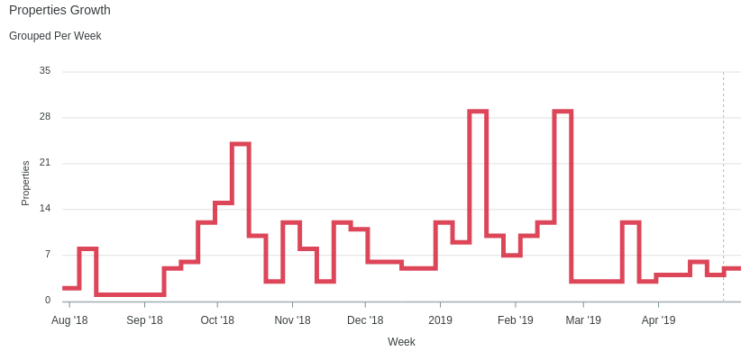

<p align="center">
  
</p>

<p align="center">
  <a href="https://github.com/styd/apexcharts.rb/blob/master/LICENSE"></a>
  <a href="https://travis-ci.org/styd/apexcharts.rb"></a>
  <a href="https://rubygems.org/gems/apexcharts"></a>
</p>


## Usage

### Cartesian Charts

Example series used for cartesian charts:

```erb
<% series = [
  {name: "Inactive", data: @inactive_properties},
  {name: "Active", data: @active_properties}
] %>
```
To build the data, you can use gem [groupdate](https://github.com/ankane/groupdate).  
In my case, it was:

```ruby
@inactive_properties = Property.inactive.group_by_week(:created_at).count
@active_properties = Property.active.group_by_week(:created_at).count
```

and I'll get the data in this format:
```ruby
{
  Sun, 29 Jul 2018=>1,
  Sun, 05 Aug 2018=>6,
  ..
}
```

Example options used for cartesian charts:

```erb
<% options = {
  title: 'Properties Growth',
  subtitle: 'Grouped Per Week',
  xtitle: 'Week',
  ytitle: 'Properties',
  stacked: true
} %>
```


#### Line Chart

```erb
<%= line_chart(series, options) %>
```


#### Stepline Chart

```erb
<%= line_chart(series, {**options, theme: 'palette7', curve: 'stepline'}) %>
```



#### Area Chart

```erb
<%= area_chart(series, {**options, theme: 'palette5'}) %>
```


#### Column Chart

```erb
<%= column_chart(series, {**options, theme: 'palette4'}) %>
```


#### Bar Chart

```erb
<%= bar_chart(series, {**options, xtitle: 'Properties', ytitle: 'Week', height: 800, theme: 'palette7'}) %>
```


#### Scatter Chart

```erb
<%= scatter_chart(series, {**options, theme: 'palette3'}) %>
```


#### Mixed Chart

You can mix charts by using `mixed_chart` or `combo_chart` methods. For example:  
Given that:
```ruby
@total_properties = Property.group_by_week(:created_at).count
```
you can do this:
```erb
<%= combo_chart({**options, theme: 'palette4', stacked: false, data_labels: false}) do %>
  <% line_chart({name: "Total", data: @total_properties}) %>
  <% area_chart({name: "Active", data: @active_properties}) %>
  <% column_chart({name: "Inactive", data: @inactive_properties}) %>
<% end %>
```


#### Syncing Chart

You can synchronize charts by using `syncing_chart` or `synchronized_chart` methods. For example:
```erb
<%= syncing_chart(chart: {toolbar: false}, height: 250, style: 'display: inline-block; width: 32%;') do %>
  <% mixed_chart(theme: 'palette4', data_labels: false) do %>
    <% line_chart({name: "Total", data: @total_properties}) %>
    <% area_chart({name: "Active", data: @active_properties}) %>
  <% end %>
  <% area_chart({name: "Active", data: @active_properties}, theme: 'palette6') %>
  <% line_chart({name: "Inactive", data: @active_properties}, theme: 'palette8') %>
<% end %>
```


#### Brush Chart

```erb
<%= area_chart(total_series, {
  **options, chart_id: 'the-chart', xtitle: nil, theme: 'palette2'
}) %>
<%= brush_chart('the-chart') do %>
  <% mixed_chart(theme: 'palette7') do %>
    <% column_chart(series.first) %>
    <% line_chart(series.last) %>
  <% end %>
<% end %>
```


#### Annotations

All cartesian charts can have annotations, for example:

```erb
<%= area_chart(series, {**options, theme: 'palette9'}) do %>
  <% x_annotation(value: ('2019-01-06'..'2019-02-24'), text: "Busy Time", color: 'green') %>
  <% y_annotation(value: 29, text: "Max Properties", color: 'blue') %>
  <% point_annotation(value: ['2018-10-07', 24], text: "First Peak", color: 'magenta') %>
<% end %>
```


### Polar Charts

#### Pie Chart

```erb
<%= pie_chart([
  {name: "Series A", data: 25},
  {name: "Series B", data: 100},
  {name: "Series C", data: 200},
  {name: "Series D", data: 125}
], legend: "left") %>
```


#### Donut Chart

```erb
<%= donut_chart([25, 100, 200, 125], theme: 'palette4' %>
```


#### Radial Bar Chart

Also called `circle_chart`.
```erb
<%= radial_bar_chart([
  {name: "Circle A", data: 25},
  {name: "Circle B", data: 40},
  {name: "Circle C", data: 80},
  {name: "Circle D", data: 45}
], legend: true) %>
```


## Installation
Add this line to your application's Gemfile:

```ruby
gem 'apexcharts'
```

And then execute:
```bash
$ bundle
```


## Web Support

### Rails

After installing the gem, require it in your `app/assets/javascripts/application.js`.
```js
//= require 'apexcharts'
```

Or, if you use `webpacker`, you can run:
```bash
yarn add apexcharts
```
and then require it in your `app/javascript/packs/application.js`.
```js
require("apexcharts")
```

## Objective
- To bring out as much apexcharts.js capabilities as possible but in ruby ways.

## TODOs
- Other charts (radar, heatmap, candlestick, etc.)
- Support other ruby frameworks (sinatra, hanami, etc.)
- Render as Vue or React elements

## Contributing
Everyone is encouraged to help improve this project by:
- Reporting bugs
- Fixing bugs and submiting pull requests
- Fixing documentation
- Suggesting new features

## License
The gem is available as open source under the terms of the [MIT License](https://opensource.org/licenses/MIT).
