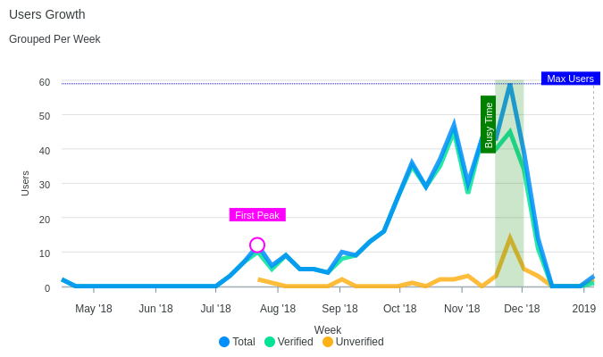

<p align="center">
  
  <span style="font-size: 40px; vertical-align: top; margin-right: 10px;">+</span>
  
</p>

<p align="center">
  <a href="https://github.com/styd/apexcharts.rb/blob/master/LICENSE"></a>
  <a href="https://travis-ci.com/styd/apexcharts.rb"></a>
</p>


<p align="center">
  <a href="https://twitter.com/intent/tweet?text=Create%20visualizations%20with%20this%20free%20and%20open-source%20JavaScript%20Chart%20library&url=https://www.apexcharts.com&hashtags=javascript,charts,visualizations,developers,apexcharts"> </a>
</p>

<p align="center">Beautiful and interactive web charts for rubyist.</p>


<p align="center"></p>

## Installation
Add this line to your application's Gemfile:

```ruby
gem 'apexcharts'
```

And then execute:
```bash
$ bundle
```

## Usage

### Cartesian Charts

Example series used for mixable charts:

```ruby
series = [
  {name: "Total", data: @total_users},
  {name: "Verified", data: @verified_users},
  {name: "Unverified", data: @unverified_users}
]
```
To build the data, you can use gem [groupdate](https://github.com/ankane/groupdate).

Example options used for mixable charts:

```ruby
options = {
  title: 'Users Growth',
  subtitle: 'Grouped Per Week',
  xtitle: 'Week', ytitle: 'Users'
}
```

#### Line Chart

```ruby
<%= line_chart(series, options) %>
```

#### Area Chart

```ruby
<%= area_chart(series, options) %>
```

#### Column Chart

```ruby
<%= column_chart(series, options) %>
```

#### Bar Chart

```ruby
<%= bar_chart(series, options) %>
```

#### Scatter Chart

```ruby
<%= scatter_chart(series, options) %>
```

All charts can have annotations, for example:

```ruby
<%= line_chart(series, options) do %>
  <% x_annotation(value: ('2018-11-18'..'2018-12-02'),
                  text: "Busy Time", color: 'green') %>
  <% y_annotation(value: 59, text: "Max Users", color: 'blue') %>
  <% point_annotation(value: ['2018-07-22', 12],
                      text: "First Peak", color: 'magenta') %>
<% end %>
```



## Web Framework

### Rails

After installing the gem, require it in your `app/assets/javascripts/application.js`.
```js
//= require 'apexcharts'
```

Or, if you use `webpacker`, you can run:
```bash
yarn add apexcharts
```
and then require it in your `app/javascript/packs/application.js`.
```js
require("apexcharts")
```

## Objective
- To bring out as much apexcharts.js capabilities as possible but in ruby ways.

## Roadmap
- Other charts (pie, donut, radar, heatmap, etc.)
- Support other ruby frameworks (sinatra, hanami, etc.)

## Contributing
Contribution directions go here.

## License
The gem is available as open source under the terms of the [MIT License](https://opensource.org/licenses/MIT).
