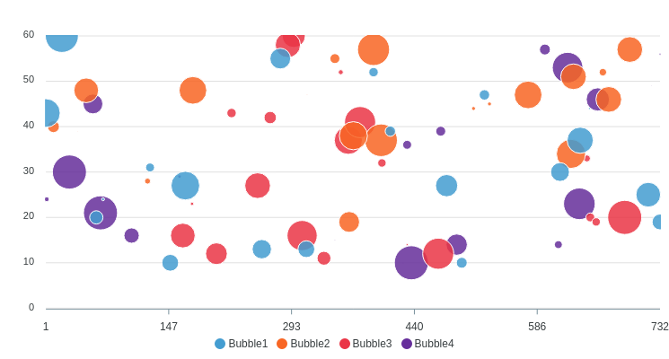

### Bubble Chart

```erb
<% bubble_series = (1..4).map do |n|
  {
    name: "Bubble#{n}",
    data: 20.times.map{[rand(750),rand(10..60),rand(70)]}
  }
end %>
<%= bubble_chart(bubble_series, data_labels: false, theme: 'palette6') %>
```

