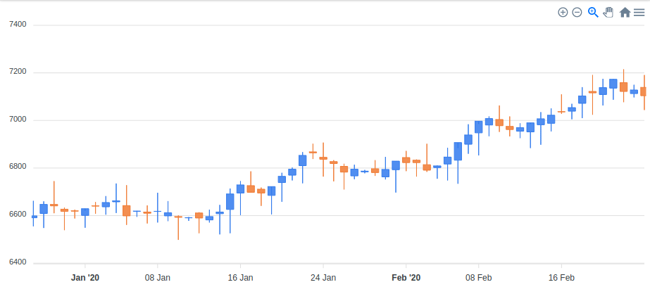

### Cartesian Charts: Part 2

#### Scatter Chart

```erb
<%= scatter_chart(series, {**options, theme: 'palette3'}) %>
```


#### Candlestick Chart

Candlestick chart is typically used to illustrate movements in the price of a
financial instrument over time. This chart is also popular by the name "ohlc chart".
That's why you can call it with `ohlc_chart` too.  
So, here's how you make it.

Given:
```erb
<%
  require 'date'

  def candlestick_data
    @acc = rand(6570..6650)
    60.times.map {|i| [Date.today - 60 + i, ohlc] }.to_h
  end

  def ohlc
    open = @acc + rand(-20..20)
    high = open + rand(0..100)
    low = open - rand(0..100)
    @acc = close = open + rand(-((high-low)/3)..((high-low)/2))
    [open, high, low, close]
  end

  candlestick_options = {
    plot_options: {
      candlestick: {
        colors: {
          upward: '#3C90EB',
          downward: '#DF7D46'
        }
      }
    }
  }
%>
```
You can make candlestick chart with this:
```erb
<%= candlestick_chart(candlestick_data, candlestick_options) %>
```



#### Box Plot Chart

Given:
```erb
<%
  require 'date'

  def box_plot_data
    20.times.map {|i| [Date.today - 20 + i, box_plot_datum] }.to_h
  end

  def box_plot_datum
    level = 1000
    max = level + rand(50..300)
    min = level - rand(50..300)
    q1 = min + rand(10..50)
    q3 = max - rand(10..50)
    median = (min + q1 + q3 + max)/4
    [min, q1, median, q3, max]
  end

  box_plot_options = {
    plot_options: {
      boxPlot: {
        colors: {
          upper: '#aaffaa',
          lower: '#ffaaFF'
        }
      }
    }
  }
%>
```
You can make box plot chart with this:
```erb
<%= box_plot_chart(box_plot_data, box_plot_options) %>
```

