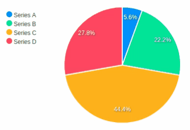

### Polar Charts

#### Pie Chart

```erb
<%= pie_chart([
  {name: "Series A", data: 25},
  {name: "Series B", data: 100},
  {name: "Series C", data: 200},
  {name: "Series D", data: 125}
], legend: "left") %>
```



#### Donut Chart

```erb
<%= donut_chart([25, 100, 200, 125], theme: 'palette4') %>
```


#### Radial Bar Chart

Also called `circle_chart`.
```erb
<%= radial_bar_chart([
  {name: "Circle A", data: 25},
  {name: "Circle B", data: 40},
  {name: "Circle C", data: 80},
  {name: "Circle D", data: 45}
], legend: true) %>
```

