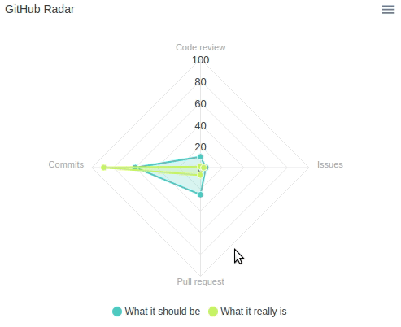

### Radar Chart

```erb
<% radar_series = [
  {
    name: "What it should be",
    data: { "Code review"=>10, "Issues"=>5, "Pull request"=>25, "Commits"=>60 }
  },
  {
    name: "What it really is",
    data: { "Code review"=>1, "Issues"=>3, "Pull request"=>7, "Commits"=>89 }
  }
] %>
<%= radar_chart(
  radar_series,
  {title: "GitHub Radar", markers: {size: 4}, theme: 'palette4'}
) %>
```

